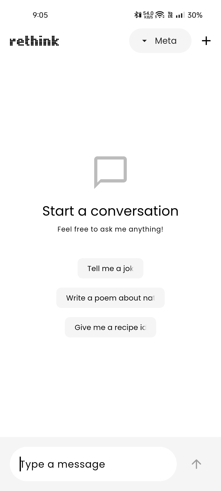
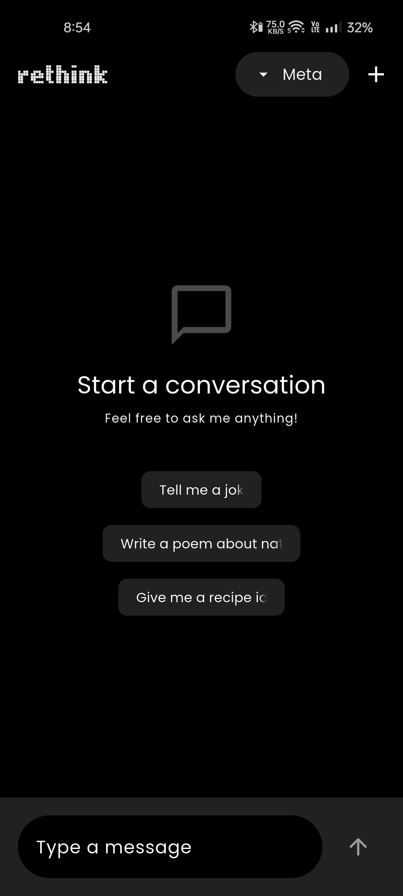
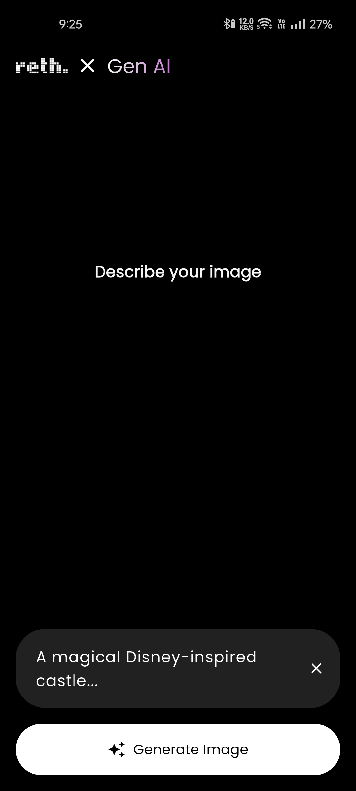
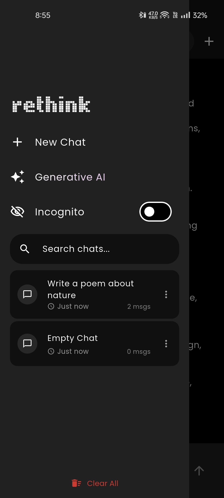
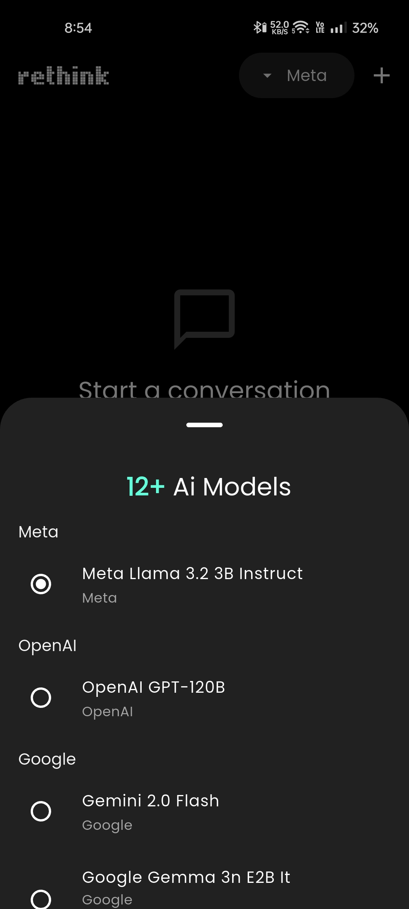
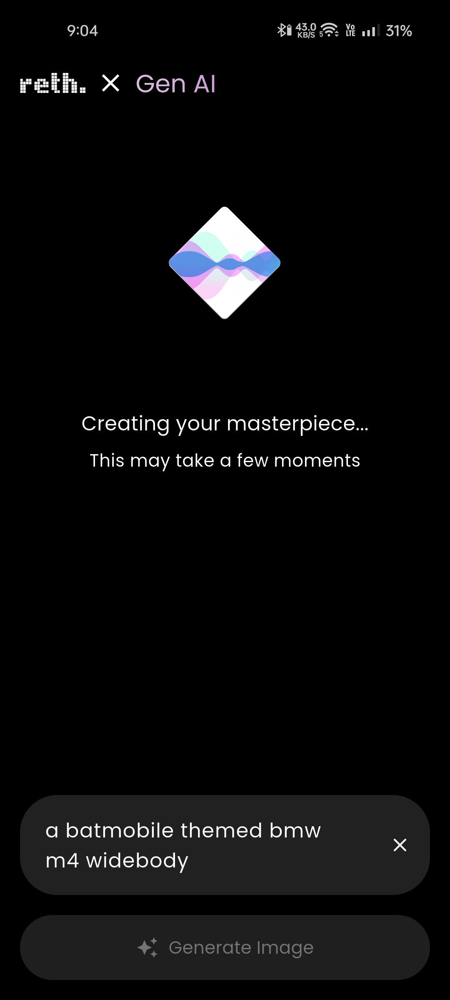
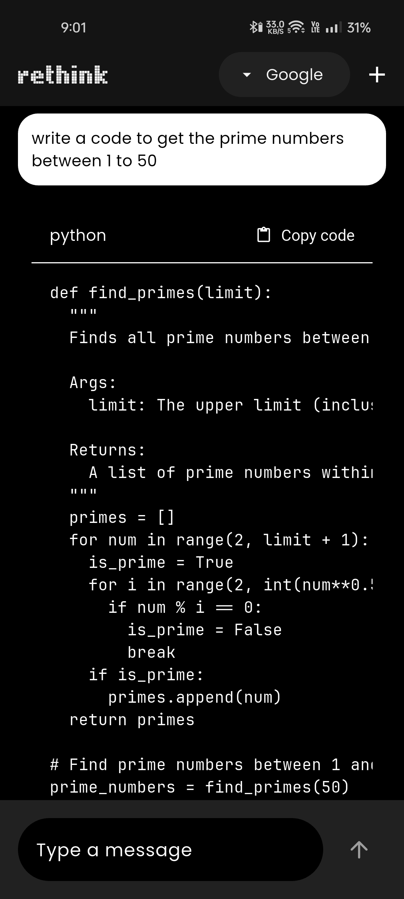
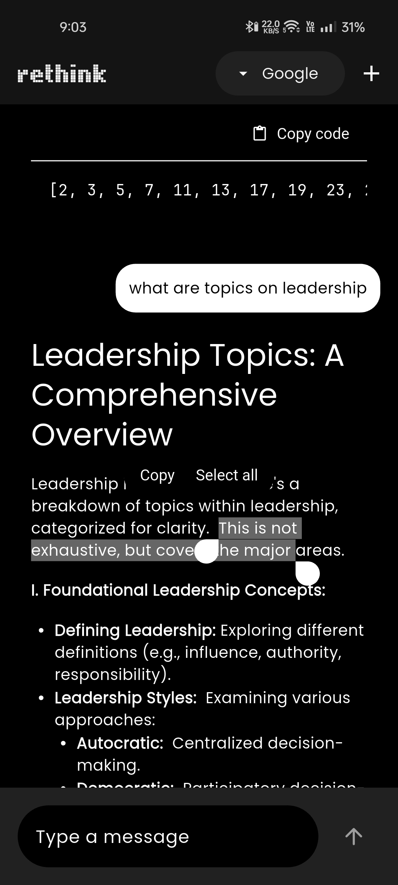
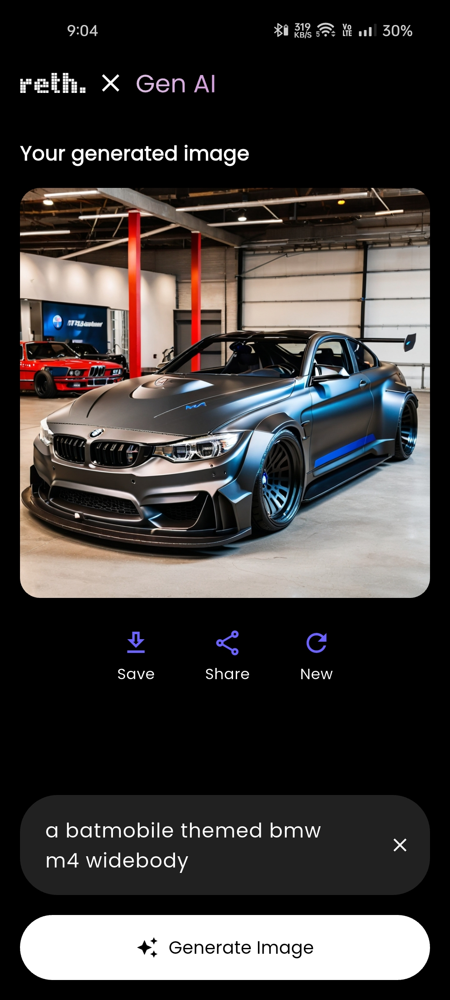

    
    <h1>rethink</h1>
    
An Alrounder AI Assistant App built in Flutter.

---

  
  
  

  
  
  

  
  
  

## Features

### Chat Assist

### Image Generation

## Installation

## Tech Stack

**Client:** Flutter, Android

**Backend:** SQLite, Openrouter, Imagine.Art SD
